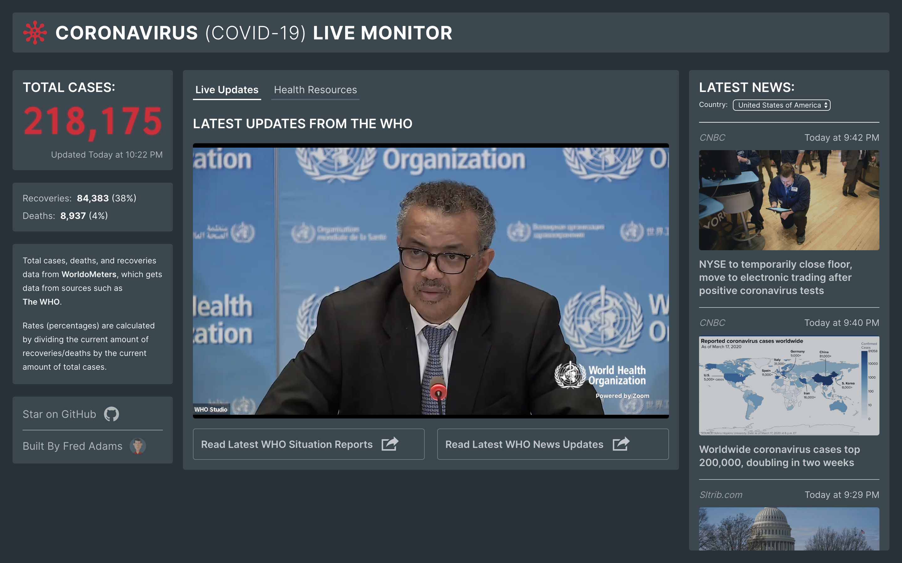

<a align="center" href="https://covid19.xtrp.io/">
    

    
    
    

Your new hub for news, information, and latest updates about the Coronavirus (COVID-19) outbreak.

## Tech Stack

-   HTML, CSS, and Javascript (ES6) &mdash; Public Site
-   PHP &mdash; Public Routes to Update Cases (includes web scraping for cases) and Press Video Data
-   Node.js/Express.js &mdash; Local web server to scrape W.H.O. site for latest press video
-   Python &mdash; Cronjobs to request PHP servers and local servers

## Third Party Software Used

-   Various NPM packages including Express.js, Puppeteer, and more
-   Various Python/PyPi modules including requests, scheduler, and more
-   [NewsAPI](https://newsapi.org/) for fetching latest news
-   [Moment.js](https://momentjs.com/) for displaying dates and times nicely

## File Structure

-   `cronjobs` &mdash; Python programs to create services that run periodically to update data for the site.
-   `scrapers` &mdash; Web scrapers to scrape third-party sites for data.
-   `site` &mdash; The main frontend site written in plain HTML, CSS, and JavaScript.
-   `site/server` &mdash; Files which run on the server to update public data for the frontend site. These files are then called/requested by the cronjobs.

## License and Credits

Coronavirus Live Monitor was built solely by web developer and student [Fred Adams](https://xtrp.io/).

The code is copyrighted and not open-source licensed.
